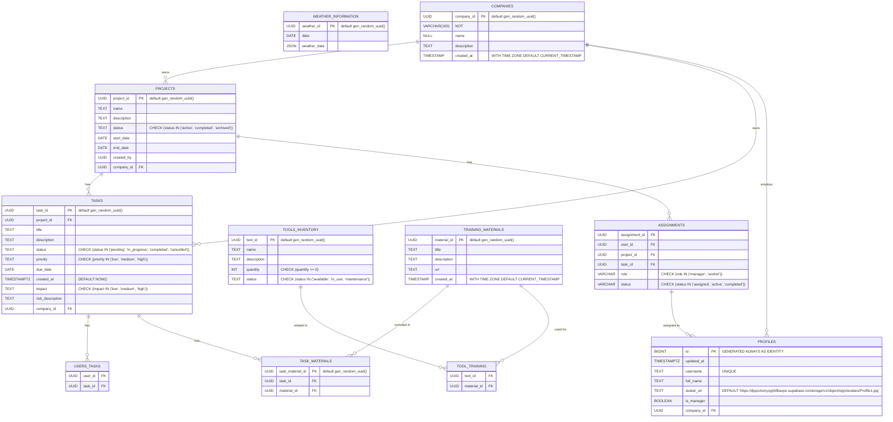

```mermaid
erDiagram
    PROJECTS {
        UUID project_id PK "default gen_random_uuid()"
        TEXT name
        TEXT description
        TEXT status "CHECK (status IN ('active', 'completed', 'archived'))"
        DATE start_date
        DATE end_date
        UUID created_by
        UUID company_id FK
    }
    TASKS {
        UUID task_id PK "default gen_random_uuid()"
        UUID project_id FK
        TEXT title
        TEXT description
        TEXT status "CHECK (status IN ('pending', 'in_progress', 'completed', 'cancelled'))"
        TEXT priority "CHECK (priority IN ('low', 'medium', 'high'))"
        DATE due_date
        TIMESTAMPTZ created_at "DEFAULT NOW()"
        TEXT impact "CHECK (impact IN ('low', 'medium', 'high'))"
        TEXT risk_description
        UUID company_id FK
    }
    USERS_TASKS {
        UUID user_id FK
        UUID task_id FK
    }
    TOOLS_INVENTORY {
        UUID tool_id PK "default gen_random_uuid()"
        TEXT name
        TEXT description
        INT quantity "CHECK (quantity >= 0)"
        TEXT status "CHECK (status IN ('available', 'in_use', 'maintenance'))"
    }
    TRAINING_MATERIALS {
        UUID material_id PK "default gen_random_uuid()"
        TEXT title
        TEXT description
        TEXT url
        TIMESTAMP created_at "WITH TIME ZONE DEFAULT CURRENT_TIMESTAMP"
    }
    TASK_MATERIALS {
        UUID task_material_id PK "default gen_random_uuid()"
        UUID task_id FK
        UUID material_id FK
    }
    TOOL_TRAINING {
        UUID tool_id FK
        UUID material_id FK
    }
    WEATHER_INFORMATION {
        UUID weather_id PK "default gen_random_uuid()"
        DATE date
        JSON weather_data
    }
    ASSIGNMENTS {
        UUID assignment_id PK
        UUID user_id FK
        UUID project_id FK
        UUID task_id FK
        VARCHAR role "CHECK (role IN ('manager', 'worker'))"
        VARCHAR status "CHECK (status IN ('assigned', 'active', 'completed'))"
    }
    COMPANIES {
        UUID company_id PK "default gen_random_uuid()"
        VARCHAR(100) NOT NULL name
        TEXT description
        TIMESTAMP created_at "WITH TIME ZONE DEFAULT CURRENT_TIMESTAMP"
    }
    PROFILES {
        BIGINT id PK "GENERATED ALWAYS AS IDENTITY"
        TIMESTAMPTZ updated_at
        TEXT username "UNIQUE"
        TEXT full_name
        TEXT avatar_url "DEFAULT 'https://djujccksnyognbfbaxpx.supabase.co/storage/v1/object/sign/avatars/Profile1.jpg'"
        BOOLEAN is_manager
        UUID company_id FK
    }

    PROJECTS ||--o{ TASKS : "has"
    PROJECTS ||--o{ ASSIGNMENTS : "has"
    TASKS ||--o{ USERS_TASKS : "has"
    TASKS ||--o{ TASK_MATERIALS : "has"
    TRAINING_MATERIALS ||--o{ TASK_MATERIALS : "included in"
    TOOLS_INVENTORY ||--o{ TOOL_TRAINING : "related to"
    TRAINING_MATERIALS ||--o{ TOOL_TRAINING : "used for"
    ASSIGNMENTS ||--o{ PROFILES : "assigned to"
    COMPANIES ||--o{ PROJECTS : "owns"
    COMPANIES ||--o{ TASKS : "owns"
    COMPANIES ||--o{ PROFILES : "employs"
```
