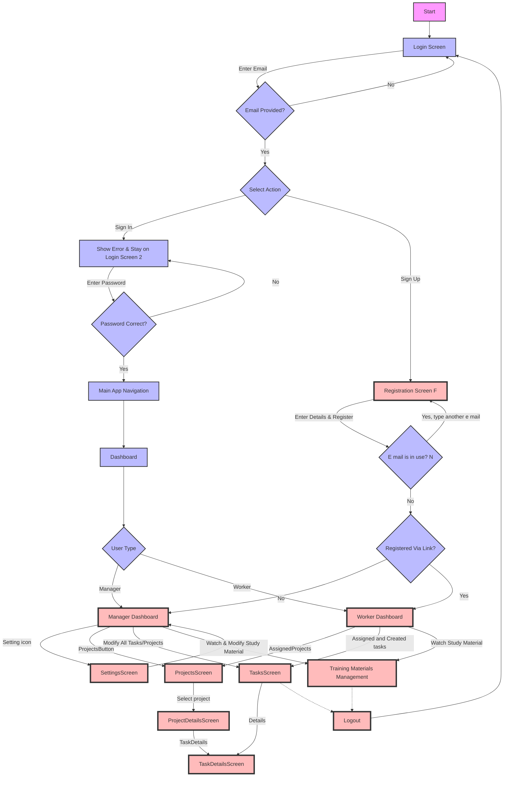

```mermaid
flowchart TD
    A[Start] --> B[Login Screen]
    B -->|Enter Email| C{Email Provided?}
    C -->|No| B
    C -->|Yes| D{Select Action}
    D -->|Sign In| E[Login Screen 2]
    D -->|Sign Up| F[Registration Screen F]
    F -->|Enter Details & Register| N{E mail is in use? N}
    N -->|Yes, type another e mail| F
    E -->|Enter Password| G{Password Correct?}
    G -->|No| E[Show Error & Stay on Login Screen 2]
    G -->|Yes| H[Main App Navigation]
    N -->|No| I{Registered Via Link?}
    I -->|No| J[Manager Dashboard]
    I -->|Yes| K[Worker Dashboard]
    K -->|AssignedProjects| U[ProjectsScreen]
    K -->|Assigned and Created tasks| P[TasksScreen]
    U -->|Select project| X[ProjectDetailsScreen] 
    X -->|TaskDetails| V[TaskScreenDetails]
    H --> L[Dashboard]
    L --> M{User Type}
    M -->|Manager| J[Manager Dashboard]   
    M -->|Worker| K
    J -->|Setting icon| T[SettingsScreen]
    T -->|Back| J[Manager Dashboard]  
    J -->|ProjectsButton| U[ProjectsScreen]
    J -->|Modify All Tasks/Projects| P[TasksScreen]
    J -->|Watch & Modify Study Material| Q[Training Materials Management]
    K -->|Watch Study Material| Q[Training Materials Management]
    P -->|Details| V[TaskDetailsScreen]
    P -.-> S[Logout]
    Q -.-> S[Logout]
    S --> B
    
    classDef startNode fill:#f9f,stroke:#333,stroke-width:2px;
    classDef actionNode fill:#bbf,stroke:#333,stroke-width:2px;
    classDef decisionNode fill:#fbf,stroke:#333,stroke-width:2px;
    classDef endNode fill:#fbb,stroke:#333,stroke-width:4px;
    class A startNode;
    class B,C,D,E,G,H,I,L,M,N actionNode;
    class F,J,K,O,P,Q,R,S,T,U,X,V endNode;
```