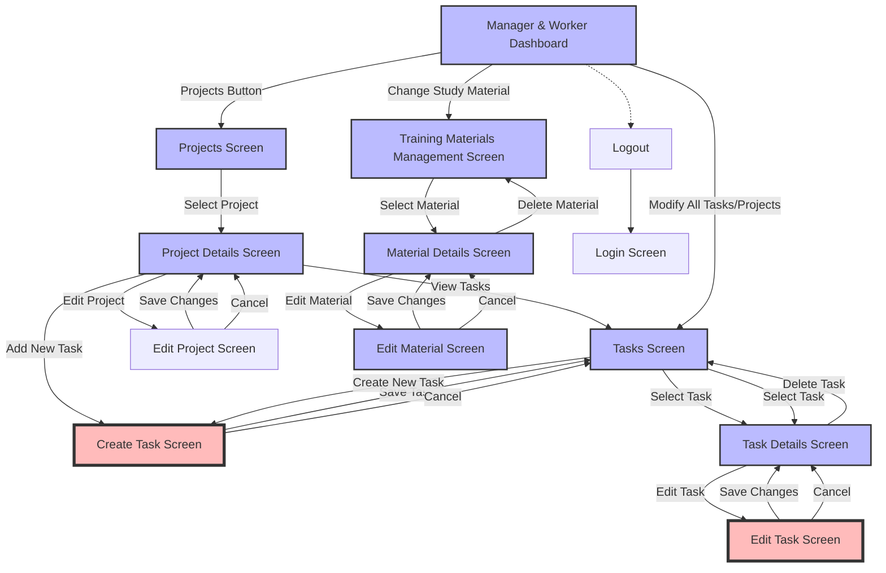

```mermaid
flowchart TD
    J[Manager & Worker Dashboard] -->|Projects Button| U[Projects Screen]
    U -->|Select Project| X[Project Details Screen]
    X -->|View Tasks| P[Task Screen]
    X -->|Edit Project| X1[Edit Project Screen]
    X1 -->|Save Changes| X
    X1 -->|Cancel| X
    X -->|Add New Task| P1[Create Task Screen]
    P1 -->|Save Task| P
    P1 -->|Cancel| P
    P -->|Select Task| V[Task Details Screen]
    V -->|Edit Task| V1[Edit Task Screen]
    V1 -->|Save Changes| V
    V1 -->|Cancel| V
    V -->|Delete Task| P
    J -->|Modify All Tasks/Projects| P[Tasks Screen]
    P -->|Create New Task| P1[Create Task Screen]
    P -->|Select Task| V[Task Details Screen]
    J -->|Change Study Material| Q[Training Materials Management Screen]
    Q -->|Select Material| Q1[Material Details Screen]
    Q1 -->|Edit Material| Q2[Edit Material Screen]
    Q2 -->|Save Changes| Q1
    Q2 -->|Cancel| Q1
    Q1 -->|Delete Material| Q
    J -.-> S[Logout]
    S --> B[Login Screen]

    classDef startNode fill:#f9f,stroke:#333,stroke-width:2px;
    classDef actionNode fill:#bbf,stroke:#333,stroke-width:2px;
    classDef decisionNode fill:#fbf,stroke:#333,stroke-width:2px;
    classDef endNode fill:#fbb,stroke:#333,stroke-width:4px;
    class J,U,X,P,V,Q,Q1,Q2 actionNode;
    class P1,V1 endNode;
```